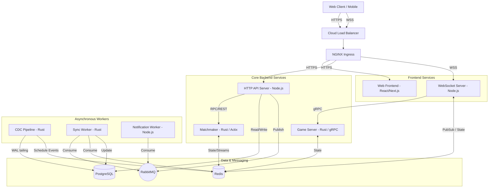
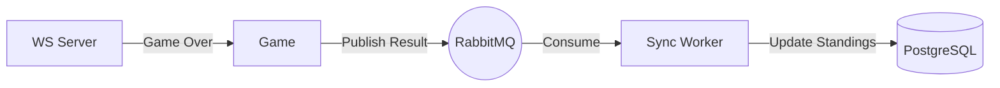
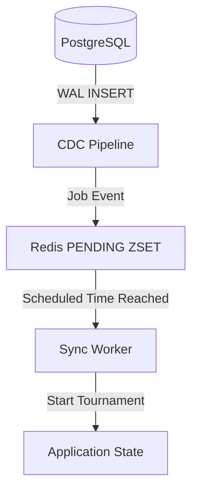
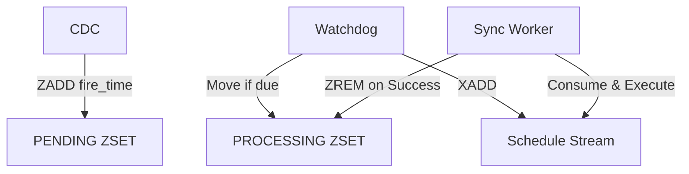
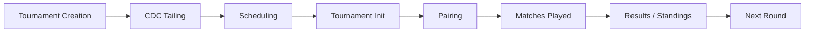
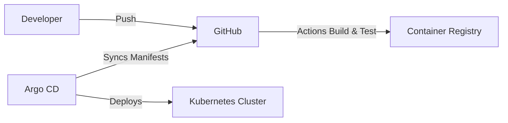

# Chess Platform Architecture

## Overview

This repository contains a modern, microservice-based chess platform. Built for high concurrency and low latency, it handles real-time matchmaking, real-time gameplay via WebSockets, scalable tournaments (Swiss and Round-Robin), and persistent user state.

## Architecture

### High-Level Architecture



### Event/Data Flow



### Architecture Overview

The system is divided into focused microservices to scale different workloads independently. Synchronous user actions (login, profile updates) are handled by a traditional REST API (HTTP Server) backed by PostgreSQL. Real-time game interactions and moves occur over WebSockets (WS Server), which communicate with the authoritative Game Server via low-latency gRPC.

Asynchronous event processing is heavily decoupled. Matchmaking is handled by a dedicated Rust service using the Actor model and Redis. Tournament progression is entirely event-driven: a CDC (Change Data Capture) service tails the PostgreSQL Write-Ahead Log (WAL) to detect tournament creations, which feeds into a distributed scheduling pipeline processed by the Sync Worker. RabbitMQ guarantees the delivery of these asynchronous domain events.

## Services

### `apps/http-server`

**Responsibility:** Authoritative REST API for user authentication, profiles, tournament creation, and admin panels.
**How It Works:** Receives standard HTTPS requests, validates payloads, and reads/writes to PostgreSQL.
**Communication:** Exposes a REST API. Communicates synchronously with PostgreSQL. Publishes events to RabbitMQ (e.g., for notifications).
**Data and State:** Purely stateless. Relies on PostgreSQL for authoritative state.
**Scaling:** Scales horizontally. Stateless design allows standard L7 load balancing.

### `apps/ws-server`

**Responsibility:** Manages all real-time WebSocket connections with clients for live gameplay, matchmaking updates, and spectator broadcasting.
**How It Works:** Clients connect via WebSockets. The server acts as a gateway, receiving moves and routing them to the authoritative Game Server for validation.
**Communication:** WebSockets to external clients. gRPC to the Game Server. Redis Pub/Sub for cross-pod communication. Redis Hashes for game state.
**Data and State:** Ephemeral socket state in memory. Live game state and spectator tracking stored in Redis (`game:state:*` and `spectate:*`).
**Scaling:** Scales horizontally using `SocketIORedisAdapter`. Redis Pub/Sub handles broadcasting events (like a move made on Pod A) to spectators connected to Pod B.

### `apps/matchmaker`

**Responsibility:** Evaluates player pools, pairs players of similar ELOs, and triggers match creation.
**How It Works:** Uses the Actix actor framework. Players enter the queue via a Redis Stream. Actors own the state of specific time controls (e.g., Bullet, Blitz). They periodically evaluate their queue, expanding the acceptable ELO gap over time until a match is found.
**Communication:** Reads player joins via Redis Streams. Writes matches to Redis.
**Data and State:** Rapidly changing matchmaking candidate state is held in actor memory (using a `BTreeMap`). Persistent queues are backed by Redis Sorted Sets (ZSET).
**Failure and Recovery:** On startup, syncs from Redis to recover queue state.
**Scaling:** Bounded by the number of time-control pools. Each time-control is a single Actor to prevent race conditions during matching.

### `apps/game-server`

**Responsibility:** The authoritative source of truth for chess logic, move validation, and game termination.
**How It Works:** Receives move requests. Validates them against the current board state. Determines checkmate, draw, or timeout conditions.
**Communication:** Exposes a gRPC interface consumed by the WebSocket Server. Reads/writes to Redis for fast state retrieval.
**Data and State:** Stateless application layer; relies on Redis for storing active game FENs, move histories, and clocks.
**Scaling:** Highly horizontally scalable as a gRPC service deployed behind a Kubernetes Headless Service.

### `apps/cdc`

**Responsibility:** Triggers tournament scheduling without polling the database.
**How It Works:** Tails the PostgreSQL Write-Ahead Log (WAL) using logical replication (`pg_output`). When a tournament is inserted, it creates a schedule job in Redis.
**Communication:** Communicates with PostgreSQL directly. Writes jobs to Redis ZSETs.
**Data and State:** Tracks processed LSNs (Log Sequence Numbers) in Redis (`cdc:pending_lsns`) to ensure it resumes correctly after a crash.
**Scaling:** Single instance/singleton deployment to maintain sequential WAL reading.

### `apps/sync-worker`

**Responsibility:** Executes scheduled tournament events, generates pairings (Swiss & Round Robin), and processes game results.
**How It Works:** Processes distributed jobs using a two-phase Redis ZSET queue and consumes RabbitMQ events.
**Communication:** Consumes from RabbitMQ and Redis Streams. Reads/writes to PostgreSQL and Redis.
**Failure and Recovery:** Implements dead-letter queues (DLQ) in RabbitMQ. Redis jobs have a visibility timeout; a watchdog re-queues jobs if a worker crashes mid-processing.
**Scaling:** Horizontally scalable. Workers compete for jobs via atomic Lua scripts and RabbitMQ consumer groups.

### `apps/notification-worker`

**Responsibility:** Asynchronous email and push notification delivery.
**Communication:** Consumes strictly from RabbitMQ.
**Scaling:** Scales horizontally based on queue depth.

## Redis Architecture

In this project, Redis is used as the high-speed state layer for ephemeral and frequently accessed data, avoiding database contention.

- **Matchmaking State:** `QUEUE_ZSET` holds pending players.
- **Game State:** `game:state:*` hashes store active game FENs, players, and clocks.
- **Spectator State:** `spectate:*` tracks active observers.
- **Live Games:** A ZSET `live:games` provides a real-time feed of active matches.
- **Locks:** Distributed locking using `SET NX PX` prevents concurrent execution (e.g., tournament scheduler watchdogs, rematch handling).

## Redis Streams and PEL

The matchmaker receives players via Redis Streams (`matchmaker:stream`).

- **Producers:** The HTTP or WS server pushes a `PlayerJoin` payload.
- **Consumers:** The matchmaker worker reads via Consumer Groups (`XREADGROUP`).
- **Acknowledgement:** `XACK` is called only after the player is successfully staged in the Actor's queue and backed up to a ZSET.
- **Failures:** If the matchmaker crashes before `XACK`, the message remains in the Pending Entry List (PEL) and is reprocessed on restart.

## RabbitMQ and Event-Driven Architecture

RabbitMQ decouples heavy domain workflows (like Tournaments) from synchronous user flows.

- **Exchanges & Queues:** Direct and Topic exchanges route events like `MatchNotificationEvent` and `TournamentMatchingDlqEvent`.
- **Reliability:** Consumers require explicit acknowledgements. Unprocessable messages are routed to a Dead Letter Queue (DLQ) for inspection.

## CDC (Change Data Capture)

Instead of polling `SELECT * FROM tournaments WHERE start_time <= NOW()`, the architecture uses zero-polling CDC.



This ensures zero database CPU overhead for scheduling and near-instant reactivity.

## gRPC Architecture

gRPC is used for high-throughput, low-latency internal communication—specifically between the WS Server and the Game Server.

- **Why gRPC:** The WS Server receives thousands of move events per second. gRPC with HTTP/2 multiplexing significantly reduces connection overhead compared to REST.
- **Service Definitions:** Protobuf definitions are centralized in `packages/grpc-connection`.
- **L4 vs L7 Considerations:** Because gRPC uses long-lived HTTP/2 connections, traditional L4 Kubernetes Services (ClusterIP) result in uneven load distribution (all traffic sticks to one pod).
- **Solution:** A Kubernetes Headless Service (`game-server-headless`) is used, allowing the client to resolve all Pod IPs and perform client-side round-robin load balancing.

## Actor-Based Matchmaking

The matchmaking engine is built on the Actix framework in Rust.

### Actor Model

Each matchmaking pool (e.g., 3|0 Blitz, 10|0 Rapid) is an isolated Actor. This eliminates shared-state locks. An actor processes one player join/leave message at a time sequentially.

### Matching Pool

The actor maintains candidate players in memory using a `BTreeMap` structured by rating.

### `VecDeque`

`VecDeque` is **not implemented** in the matchmaking pool in this repository. A `BTreeMap` is used instead because matchmaking requires fast range queries (e.g., finding candidates within `rating - 50` to `rating + 50`), which `BTreeMap` handles efficiently (O(log N)) whereas `VecDeque` would require O(N) linear scanning.

### Matching Algorithm

1. Player enters via Stream.
2. The Actor inserts the player into the `BTreeMap` and the Redis ZSET backup.
3. Every tick, the Actor checks presence (via Redis pipeline) to ensure players haven't disconnected.
4. The algorithm calculates `wait_time * EXPANSION_RATE` to widen the acceptable ELO gap.
5. `BTreeMap::range` efficiently finds opponents in the expanded ELO bracket.
6. A match is published, and players are atomically removed from the pool.

## Scheduler

The tournament and event scheduler uses a two-phase Redis ZSET approach.



- **ZSET Score:** Represents the Unix timestamp when the job is due.
- **Failure Recovery:** If a worker crashes, the job remains in `PROCESSING_ZSET`. A watchdog scans for jobs with visibility timeouts that have expired and re-queues them.

## Tournament System

Tournaments are deeply integrated into the asynchronous worker pipeline.

### Tournament Lifecycle



### Swiss System

The repository implements a genuine Swiss pairing algorithm (Edmonds' blossom Maximum Weight Perfect Matching).

- **Pairings:** Players are grouped by score. The algorithm pairs players with identical scores while avoiding repeat matchups.
- **Colors:** Balances white/black assignments and prevents three identical colors in a row.
- **Progression:** The Sync Worker calculates standings, applies tiebreaks, and automatically schedules the next round.

### Round Robin

For smaller club tournaments, the repository generates a full Round Robin matrix. All permutations are generated up-front, avoiding duplicates, and scheduled sequentially.

## Game Architecture

### Game Spectator

- **Connection:** Spectators connect via WebSockets to `apps/ws-server`.
- **State:** Live board state is pulled from `spectate:<game_id>` in Redis.
- **Broadcast:** When a move is made, the WS Server broadcasts it to the room. Redis Pub/Sub ensures spectators on _any_ WS pod receive the event.

### WebSockets & Scaling

WebSocket state is strictly bound to the pod the client connected to. To solve horizontal scaling, `SocketIORedisAdapter` is utilized. When Pod A needs to broadcast to a room, it publishes to Redis; Pod B receives the pub/sub event and pushes it to its local connected clients.

### Game Analysis and WASM

To avoid expensive backend CPU usage, game analysis (Stockfish) is offloaded to the client using WebAssembly (WASM).

- **Implementation:** The `apps/web` frontend uses `useStockfish.ts` to load the Stockfish WASM engine.
- **Execution:** Analysis runs locally in the user's browser via Web Workers, entirely isolated from backend load.

## Kubernetes Architecture

Deployed via Argo CD, the infrastructure uses modern Kubernetes primitives.

- **Services:** Frontend and HTTP API use standard `ClusterIP` services.
- **Ingress:** NGINX Ingress controller routes external HTTPS and WSS traffic. TLS is managed via `cert-manager`.
- **Headless Services:** Used for gRPC (`game-server-headless`) to bypass kube-proxy and enable client-side load balancing.
- **Secrets:** `SealedSecrets` encrypt configuration directly in Git.

## CI/CD and GitOps



- **CI:** GitHub Actions builds Docker images, runs tests, and pushes to GHCR.
- **GitOps:** Argo CD continuously monitors `chess-k8s/apps`. When configurations change or image tags are updated, Argo CD automatically reconciles the Kubernetes cluster state to match Git.

## Service Communication Matrix

| Service     | Talks To    | Protocol       | Purpose                    | State              |
| ----------- | ----------- | -------------- | -------------------------- | ------------------ |
| HTTP Server | PostgreSQL  | TCP (pg)       | Reads/writes user data     | Stateless          |
| HTTP Server | RabbitMQ    | AMQP           | Send emails                | Stateless          |
| WS Server   | Game Server | gRPC           | Move validation            | Ephemeral/Redis    |
| WS Server   | Redis       | Redis (PubSub) | Cross-pod broadcast        | Ephemeral/Redis    |
| Matchmaker  | Redis       | Redis          | Queue ingestion/evaluation | Actor memory/Redis |
| CDC         | PostgreSQL  | Logical Repl   | Detect new tournaments     | Redis LSN          |
| Sync Worker | RabbitMQ    | AMQP           | Process results            | Stateless          |
| Sync Worker | PostgreSQL  | TCP (pg)       | Update standings           | Stateless          |

## Architecture Decisions & Trade-Offs

| Decision                 | Why                                                                                                            | Trade-Off                                                                          |
| ------------------------ | -------------------------------------------------------------------------------------------------------------- | ---------------------------------------------------------------------------------- |
| **Microservices**        | Isolates critical real-time components (Game/WS) from slow transactional ones (HTTP/Postgres).                 | Increased deployment complexity and debugging overhead.                            |
| **Actor Model**          | Prevents race conditions during matchmaking by giving a single thread ownership of a specific player pool.     | A single hot time-control (e.g., Bullet) is bound to a single thread's throughput. |
| **BTreeMap vs VecDeque** | Matchmaking requires finding ELO brackets (ranges). `VecDeque` is O(N) for this, while `BTreeMap` is O(log N). | Slightly higher memory overhead and insertion cost.                                |
| **WASM Stockfish**       | Offloads massive CPU computation to the client's device.                                                       | Increased initial page load time to download the WASM binary.                      |
| **CDC WAL Tailing**      | Zero CPU overhead on PostgreSQL for scheduling checks.                                                         | Increased operational complexity; requires logical replication slots.              |
| **gRPC Headless Svc**    | Allows client-side load balancing across game servers.                                                         | Exposes pod IPs directly to internal clients.                                      |

## Reliability and Failure Handling

- **Crash Recovery with Distributed State:** The architecture strongly separates compute (Kubernetes Pods) from state (Redis/PostgreSQL). When a service crashes, no critical state is lost:
  - _Matchmaker Crash:_ On restart, the new actor instances invoke `sync_from_redis` to automatically recover their matchmaking queues (from `QUEUE_ZSET`) and resume pairing without dropping players.
  - _WebSocket Server Crash:_ If a WS gateway crashes, client connections drop. However, clients are built to auto-reconnect to another healthy pod. Since live game states and spectator mappings are centralized in Redis (`game:state:*` and `spectate:*`), the new pod seamlessly resumes the session.
  - _Worker Crash:_ If a `sync-worker` crashes mid-execution, a Redis ZSET watchdog scans for jobs with expired visibility timeouts in `PROCESSING_ZSET` and re-queues them. Unacknowledged RabbitMQ messages are safely redelivered to other healthy workers.
  - _CDC Crash:_ The CDC worker writes its last processed LSN (Log Sequence Number) to Redis (`cdc:pending_lsns`). On crash recovery, it reads this LSN to resume tailing the PostgreSQL WAL exactly where it left off.
- **Redis Crash:** High impact. Matchmaking queues would empty, and active games would drop. Requires Redis persistence (AOF/RDB) or HA clustering.

## Scalability

- **Database:** Postgres is the ultimate bottleneck, but it is heavily shielded. It only handles persistent profiles and final tournament results.
- **Matchmaker:** Highly concurrent due to Actor isolation, but individual time controls cannot be sharded across multiple actors without coordination.
- **WebSocket:** Horizontally scales infinitely due to Redis Pub/Sub adapter.

## Repository Structure

```text
.
├── apps/
│   ├── cdc/                  # Rust Postgres WAL reader
│   ├── game-server/          # Rust gRPC Game logic
│   ├── http-server/          # Node.js REST API
│   ├── matchmaker/           # Rust Actix Matchmaking
│   ├── notification-worker/  # Node.js Email worker
│   ├── sync-worker/          # Rust Tournament/Scheduler worker
│   ├── web/                  # Next.js Frontend
│   └── ws-server/            # Node.js WebSocket gateway
├── packages/                 # Shared libraries (gRPC, DB clients, UI)
├── chess-k8s/                # Kubernetes manifests and ArgoCD configs
├── .github/workflows/        # CI/CD Pipelines
└── docker-compose.*.yml      # Local development setups
```
